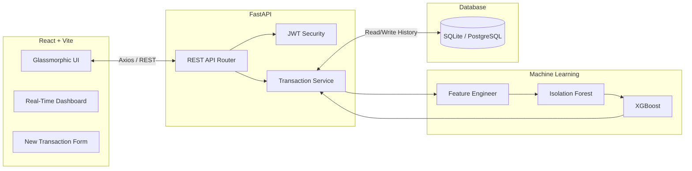

<div align="center">
  

  <br />
  <br />

  # 🛡️ PayGuard AI – Enterprise Fraud Detection

  **Real-Time, Machine Learning-Powered UPI Transaction Monitoring**

  [](https://reactjs.org/)
  [](https://fastapi.tiangolo.com/)
  [](#)
  [](#)
</div>

<br />

## 🌟 Overview

PayGuard AI is an end-to-end, real-time transaction monitoring system designed to detect and block fraudulent UPI payments in milliseconds. By leveraging a hybrid Machine Learning pipeline (Isolation Forests for anomaly detection and XGBoost for supervised fraud probability), it adapts to evolving threats while providing explainable AI (XAI) insights via SHAP.

### ✨ Key Features
- **⚡ Real-Time ML Inference**: Sub-50ms predictions combining supervised and unsupervised learning.
- **🧠 Dynamic Feature Engineering**: Resolves the "Cold Start Problem" by querying the SQLite database in real-time to compute historical user behavioral deviations, transaction velocity, and geographic anomalies.
- **🎨 Glassmorphic UI**: A premium, highly responsive React dashboard built with TailwindCSS and Framer Motion micro-animations.
- **🛡️ Secure Backend**: FastAPI backend with robust Pydantic validation, JWT authentication, and robust CORS management.

---

## 🏗️ System Architecture

PayGuard AI is built on a modern, decoupled architecture:



### 🧠 The ML Pipeline
1. **Data Preprocessing**: Standardizes numeric features and applies one-hot encoding to categorical variables (e.g., Merchant Category).
2. **Feature Engineering (Real-Time)**: Fetches the user's last 50 transactions from the database to calculate rolling features (`tx_velocity_1h`, `behavior_deviation`, `location_mismatch`).
3. **Isolation Forest**: Generates an unsupervised `anomaly_score` for the enriched feature set.
4. **XGBoost**: Takes the enriched features + anomaly score to output a definitive `fraud_probability` (0.0 to 1.0).
5. **Decision Engine**: Calculates a blended Risk Score (0-100) and executes an `approved` or `blocked` decision.

---

## 🚀 Getting Started

### 1️⃣ Clone the Repository
```bash
git clone https://github.com/AdityaK05/PayGuard-Fraud-Detection.git
cd PayGuard-Fraud-Detection
```

### 2️⃣ Start the Backend (FastAPI)
```bash
cd backend
python -m venv .venv
# Activate venv: .\.venv\Scripts\activate (Windows) or source .venv/bin/activate (Mac/Linux)
pip install -r requirements.txt
python -m uvicorn src.main:app --reload --port 8000
```
*Note: A demo admin user will be seeded automatically on first run (`admin@payguard.ai` / `admin123!`).*

### 3️⃣ Start the Frontend (React + Vite)
```bash
cd frontend
npm install
npm run dev
```
Navigate to `http://localhost:5173` to view the dashboard!

---

## 📸 Dashboard Preview

*A beautifully animated, dark-mode glass UI built for financial analysts.*

<div align="center">
  
</div>

<br/>

## 🛠️ Technology Stack

| Domain | Technology |
|---|---|
| **Frontend** | React 18, Vite, TypeScript, TailwindCSS, Framer Motion, Recharts, Lucide Icons |
| **Backend** | Python 3.10+, FastAPI, SQLAlchemy, Pydantic, Passlib, Uvicorn |
| **Machine Learning** | Scikit-Learn (Isolation Forest), XGBoost, Pandas, SHAP |
| **Database** | SQLite (Development) |

---

<div align="center">
  Made with ❤️ by <a href="https://github.com/AdityaK05">AdityaK05</a>
</div>
